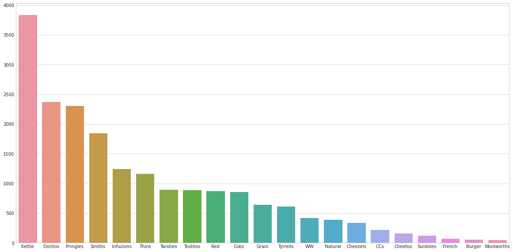
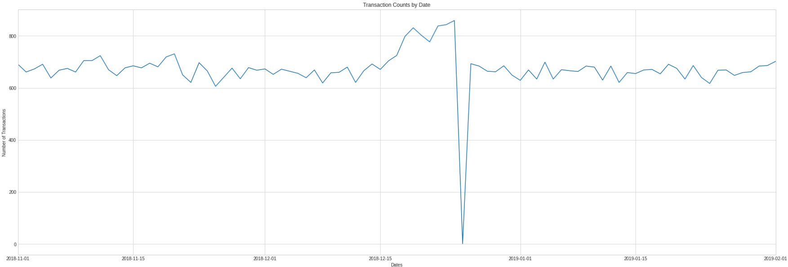
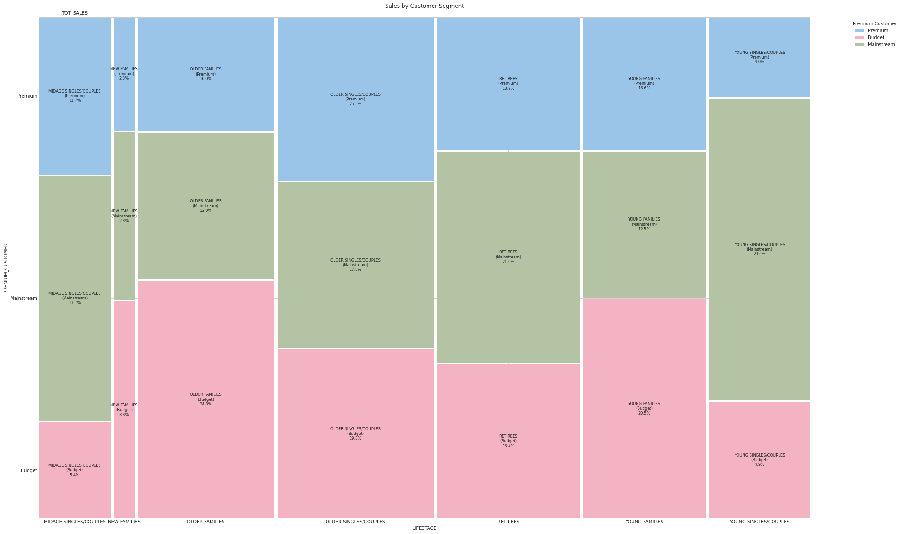

# Quantium-Virtual-Internship---Retail-Strategy-and-Analytics-Task-1
This is a project to analyze customer data from a client, the Category Manager for Chips, who wants to better understand the types of customers who purchase Chips and their purchasing behavior within the region.
<br>This project is the task 1 of the Quantium Virtual Internship program which can be found on [Forage](https://www.theforage.com/virtual-experience/NkaC7knWtjSbi6aYv/quantium/data-analytics-rqkb/data-preparation-and-customer-analytics).
## Project Overview
As part of Quantium’s retail analytics team, this project aims to understand customer purchasing behavior for the Chips category within a supermarket chain. The insights derived from this analysis will contribute to the strategic planning for the chip category for the upcoming semester.

## Data Description
The dataset includes transaction records and customer demographic information. These datasets have been cleaned and preprocessed to ensure quality and reliability for the analysis. 

- **Transaction Data**: Contains the transaction records for chip purchases, including product details, quantities, and prices. It has 8 columns : `DATE`, `STORE_NBR`,`LYLTY_CARD_NBR`, `TXN_ID`, `PROD_NBR`, `PROD_NAME`, `PROD_QTY`, `TOT_SALES`. 
- **Customer Data**: Includes customer demographic information such as `LIFESTAGE` and `PREMIUM_CUSTOMER`. It has 3 columns `LYLTY_CARD_NBR`, `LIFESTAGE`, `PREMIUM_CUSTOMER`.

  <br>`LIFESTAGE`: Customer attribute that identifies whether a customer has a family or not and what point in life they are at e.g. are their children in pre-school/primary/secondary school.
  <br>`PREMIUM_CUSTOMER`: Customer segmentation used to differentiate shoppers by the price point of products they buy and the types of products they buy. It is used to identify whether customers may spend more for quality or brand or whether they will purchase the cheapest options.

## Repository Structure
- `Data/`: Directory containing all the `.csv` files used in the analysis.
- `Quantium_task_1_data.ipynb`: Colab notebook containing the analysis in Python.

## Key Objectives
1. **Examine Transaction Data**: Identify inconsistencies, missing data, outliers, and ensure correct category items and numeric data.
2. **Examine Customer Data**: Validate data quality, handle null values, and merge transaction and customer data.
3. **Data Analysis & Customer Segments**: Analyze total sales, drivers of sales, and sales distribution across different segments. Explore trends and derive insights.
4. **Deep Dive into Customer Segments**: Formulate strategic recommendations based on the purchasing behavior of different customer segments.

## Analysis Approach
- High-level data checks and cleaning.
- Deriving additional features such as pack size and brand from the product data.
- Defining and calculating key metrics to understand purchasing behaviors.
- Visualizing data to uncover trends and insights.
- Formulating a data-driven strategy for chip category management.

## Graphs to look at:
- Popular Brands amoung the Young Singles/Couples `LIFESTAGE`:<br>
- Transactions During Christmas Period:<br>
- Total Sales among different `LIFESTAGE` categories by `PREMIUM_CUSTOMER`:<br>
  

## How to Use
1. **Clone the Repository:**
   ```sh
   git clone https://github.com/Sun-of-a-beach/Quantium-Virtual-Internship---Retail-Strategy-and-Analytics-Task-1.git
   ```
2. **Run directly on Colab environment:**
   [](https://colab.research.google.com/github/Sun-of-a-beach/Quantium-Virtual-Internship---Retail-Strategy-and-Analytics-Task-1/blob/main/Quantium_task_1_data.ipynb)
